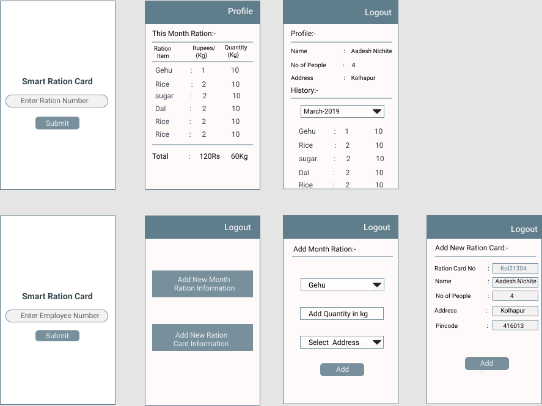

# Smart-Ration-Card

Smart Ration Card App using ReactJS,CSS,Botstrap,NodeJS,ExpressJs,PassportJS,MongoDB.

## Application Name

Smart-Ration-Card

## Author:

[Aadesh Nichite](https://github.com/AadeshNichite)

## Technology Used:

ReactJS, CSS, Bootstrap, NodeJS, ExpressJs, PassportJS, MongoDB

## Objective:

Create a Smart-Ration-Card App.

## Description

Smart-Ration-Card is the app which help ration holder to know how much ammount of ration they will get at present month.

## Demo 
Username: MH2100
Password: ABCDEFG

## Design

## Visit:
